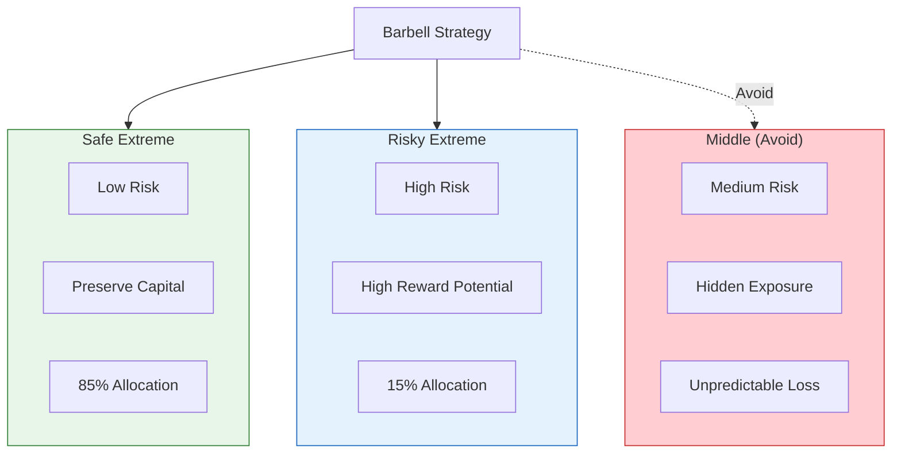

# S1 Baseline: Barbell Strategy (Generic Approach)

**Approach**: Standard diagram selection based on content type
- Content has "extremes vs middle" → Use flowchart with subgraphs
- Content has comparison → Side-by-side layout
- Applied generic color palette

---

## Generated Diagram

---

## Analysis

**What this diagram does:**
- Shows three categories (safe, middle, risky)
- Uses color to distinguish good vs bad
- Connects to central strategy node

**What this diagram lacks:**
- No visual metaphor of "barbell" shape
- Doesn't show the mathematical logic (bounded vs unbounded downside)
- Doesn't emphasize the asymmetry of outcomes
- Generic structure that could apply to any three-option choice
