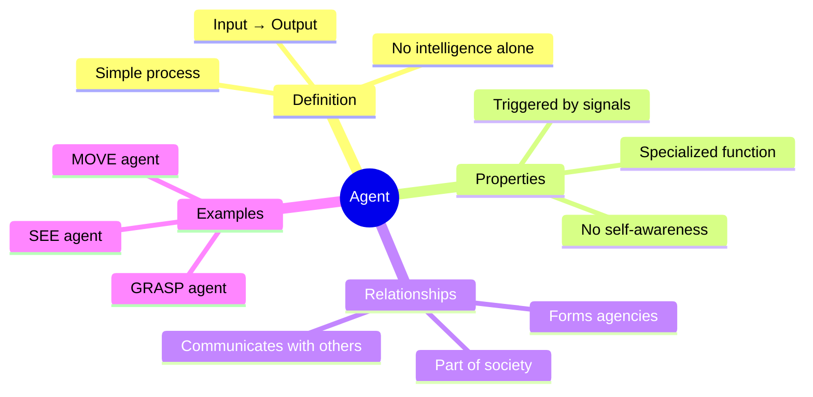
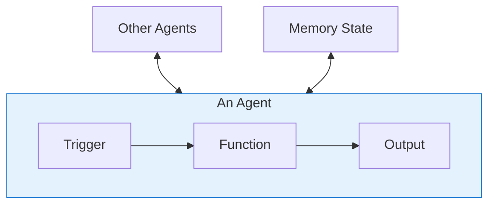

# S2 Baseline: Agents (Generic Approach)

**Approach**: Standard diagram selection based on content type
- Content defines a concept → Use mindmap for overview
- Content has hierarchy → Use flowchart TB
- Applied generic color palette

---

## Generated Diagram

---

## Supplementary Diagram

---

## Analysis

**What this diagram does:**
- Mindmap captures the hierarchical definition
- Flowchart shows basic input/output model
- Standard concept overview structure

**What this diagram lacks:**
- Doesn't show the key insight: agents vs traditional parts
- Missing the dynamic interaction pattern
- No visualization of how agents form agencies
- Doesn't distinguish between agent types
- Generic structure that doesn't reveal cognitive science concepts
