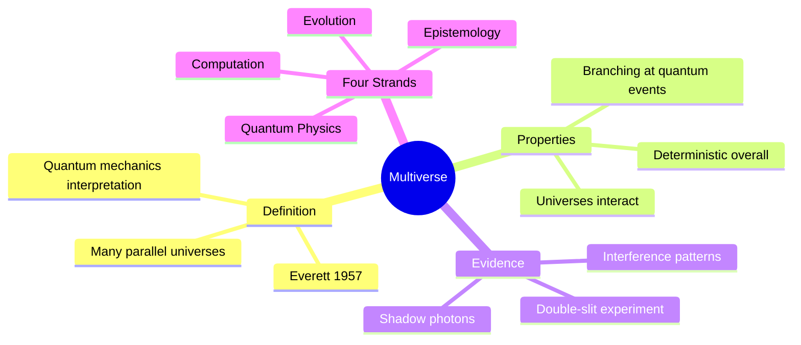
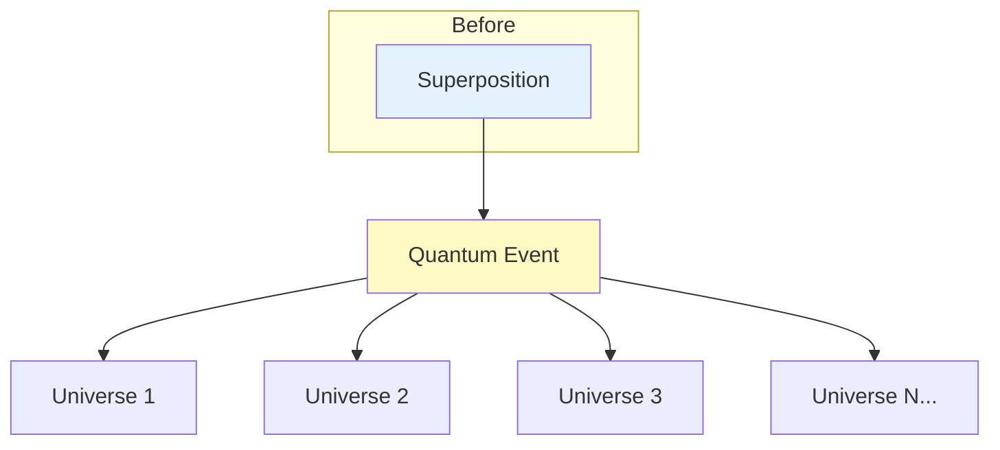

# S3 Baseline: The Multiverse (Generic Approach)

**Approach**: Standard diagram selection based on content type
- Content describes a concept → Use mindmap
- Content has branching structure → Use flowchart
- Applied generic color palette

---

## Generated Diagram

---

## Supplementary Diagram

---

## Analysis

**What this diagram does:**
- Mindmap covers the key points
- Flowchart shows branching metaphor
- Captures basic structure of the concept

**What this diagram lacks:**
- Doesn't show the argument structure (claim → evidence → conclusion)
- Missing the key epistemological point (interpretation vs reality)
- Doesn't visualize the double-slit experiment as evidence
- No contrast with Copenhagen interpretation
- Generic branching diagram that doesn't show WHY we should believe it
