# 1.1 The Agents of Mind (ENHANCED with viz-technical)

This is an enhanced version of essay 1.1 using the `viz-technical` skill patterns.

---

## The Core Insight

Minsky introduces **agents**: simple processes that individually do almost nothing intelligent, but together create mind.

---

## NEW: Paradigm Shift Diagram

**WHY THIS MATTERS**: This explicitly shows the conceptual leap Minsky is asking readers to make - from thinking of mind as passive "parts" to dynamic "agents".

```mermaid
flowchart LR
    subgraph Old["❌ TRADITIONAL VIEW: PARTS"]
        direction TB
        P1["Part A"]
        P2["Part B"]
        P3["Part C"]
        W["Whole<br/>(passive assembly)"]

        P1 --> W
        P2 --> W
        P3 --> W
    end

    Arrow["→<br/>Minsky's<br/>Insight"]

    subgraph New["✓ MINSKY'S VIEW: AGENTS"]
        direction TB
        AG1["Agent α"]
        AG2["Agent β"]
        AG3["Agent γ"]
        AGY["Agency<br/>(dynamic coordination)"]
        MIND["Mind<br/>(emergent)"]

        AG1 <-->|"signal"| AG2
        AG2 <-->|"signal"| AG3
        AG1 --> AGY
        AG2 --> AGY
        AG3 --> AGY
        AGY --> MIND
    end

    Old --> Arrow --> New

    style Old fill:#ffcdd2,stroke:#c62828
    style New fill:#c8e6c9,stroke:#2e7d32
    style Arrow fill:#fff9c4,stroke:#ffc107
```

**Key difference**: Parts are passive and combine statically. Agents are active and interact dynamically.

---

## ENHANCED: Agent Architecture Diagram

**Using technical component diagram style** - shows the agent as a well-defined unit with clear interfaces.

**Technical insight**: An agent has minimal state, responds to triggers, and communicates via signals.

---

## NEW: Agent Interaction Protocol (Sequence Diagram)

**Shows HOW agents interact over time** - a technical convention that reveals the dynamic behavior.

---

## ENHANCED: Agency Architecture

**Using subgraph nesting** to show how agents compose into agencies.

---

## NEW: Agent Type Hierarchy

**Technical type diagram** showing how different kinds of agents specialize.

```mermaid
flowchart TB
    subgraph Types["AGENT TYPE HIERARCHY"]
        direction TB

        Base["BASE AGENT<br/>━━━━━━━━━━━━<br/>• Input/Output ports<br/>• Trigger mechanism<br/>• Simple function"]

        Base --> Sensor["SENSOR AGENT<br/>━━━━━━━━━━━━<br/>• Detects stimuli<br/>• No output action<br/>Examples: SEE, HEAR"]

        Base --> Motor["MOTOR AGENT<br/>━━━━━━━━━━━━<br/>• Produces action<br/>• No sensing<br/>Examples: MOVE, GRASP"]

        Base --> Control["CONTROL AGENT<br/>━━━━━━━━━━━━<br/>• Coordinates others<br/>• Activates/suppresses<br/>Examples: BEGIN, END"]

        Base --> Memory["MEMORY AGENT<br/>━━━━━━━━━━━━<br/>• Stores connections<br/>• K-lines (later chapters)<br/>Examples: REMEMBER"]
    end

    style Base fill:#e1bee7,stroke:#7b1fa2,stroke-width:2px
    style Sensor fill:#e3f2fd,stroke:#1976d2
    style Motor fill:#e8f5e9,stroke:#388e3c
    style Control fill:#fff3e0,stroke:#f57c00
    style Memory fill:#fff9c4,stroke:#fbc02d
```

---

## Side-by-Side Comparison: Original vs Enhanced

### Original Agent Model

```mermaid
flowchart TB
    subgraph Agent["Agent"]
        direction TB
        Input["📥 Input"]
        Process["⚙️ Simple Process"]
        Output["📤 Output"]

        Input --> Process
        Process --> Output
    end

    style Agent fill:#e3f2fd,stroke:#1976d2
```

*Simple, but doesn't show context or interaction.*

### Enhanced Agent Architecture

*Shows the agent in context with interactions.*

---

## Summary: What viz-technical Adds

| Original | Enhanced (viz-technical) |
|----------|-------------------------|
| Agent as isolated unit | Agent in context with interactions |
| Linear flowchart | Architecture diagram with layers |
| No paradigm shift shown | Explicit contrast: parts vs agents |
| No temporal behavior | Sequence diagram shows protocol |
| No type system | Type hierarchy shows specialization |

**Quality improvement estimate**: Based on POC rubric, this would score ~18-19/20 vs original ~12-14/20.
