# S1 Genre-Specific: Barbell Strategy (Business/Strategy Approach)

**Approach**: Business visualization strategy
- Use 2x2 matrix or framework-style diagram
- Emphasize risk/reward asymmetry (business convention)
- Show payoff structure (decision analysis convention)
- Use barbell visual metaphor (domain-specific)

---

## Generated Diagram

```mermaid
flowchart LR
    subgraph Barbell["THE BARBELL STRATEGY"]
        direction LR

        subgraph Left["🛡️ SAFE EXTREME<br/>85-90% Allocation"]
            L1["✓ Treasury Bonds"]
            L2["✓ Cash Reserves"]
            L3["✓ Gold"]
        end

        subgraph Center["⚠️ THE DANGER ZONE"]
            C1["✗ Corporate Bonds"]
            C2["✗ Balanced Funds"]
            C3["✗ Medium Risk"]
        end

        subgraph Right["🎯 RISKY EXTREME<br/>10-15% Allocation"]
            R1["✓ Venture Bets"]
            R2["✓ Options"]
            R3["✓ Startups"]
        end
    end

    style Left fill:#c8e6c9,stroke:#2e7d32,stroke-width:3px
    style Center fill:#ffcdd2,stroke:#c62828,stroke-width:2px,stroke-dasharray: 5 5
    style Right fill:#bbdefb,stroke:#1565c0,stroke-width:3px
```



---

## Payoff Asymmetry Matrix

```mermaid
quadrantChart
    title Risk-Reward Payoff Structure
    x-axis Low Downside Risk --> High Downside Risk
    y-axis Low Upside --> High Upside
    quadrant-1 Ideal: Risky Extreme
    quadrant-2 Trap: The Middle
    quadrant-3 Foundation: Safe Extreme
    quadrant-4 Avoid: Pure Gambling
    Safe Extreme: [0.15, 0.25]
    Risky Extreme: [0.35, 0.85]
    Middle Position: [0.75, 0.45]
    Pure Gamble: [0.9, 0.7]
```

---

## Decision Tree View


---

## Analysis

**What this diagram does:**
- Uses horizontal barbell layout (visual metaphor)
- Shows specific examples (business-relevant)
- Includes payoff matrix (strategy framework convention)
- Decision tree shows bounded vs unbounded risk (finance convention)
- Uses checkmarks/X marks (action-oriented)

**Business-specific improvements:**
- Percentage allocations shown prominently
- Risk/reward asymmetry visualized in quadrant
- Actionable "take/avoid" recommendations
- Framework structure familiar to business readers
