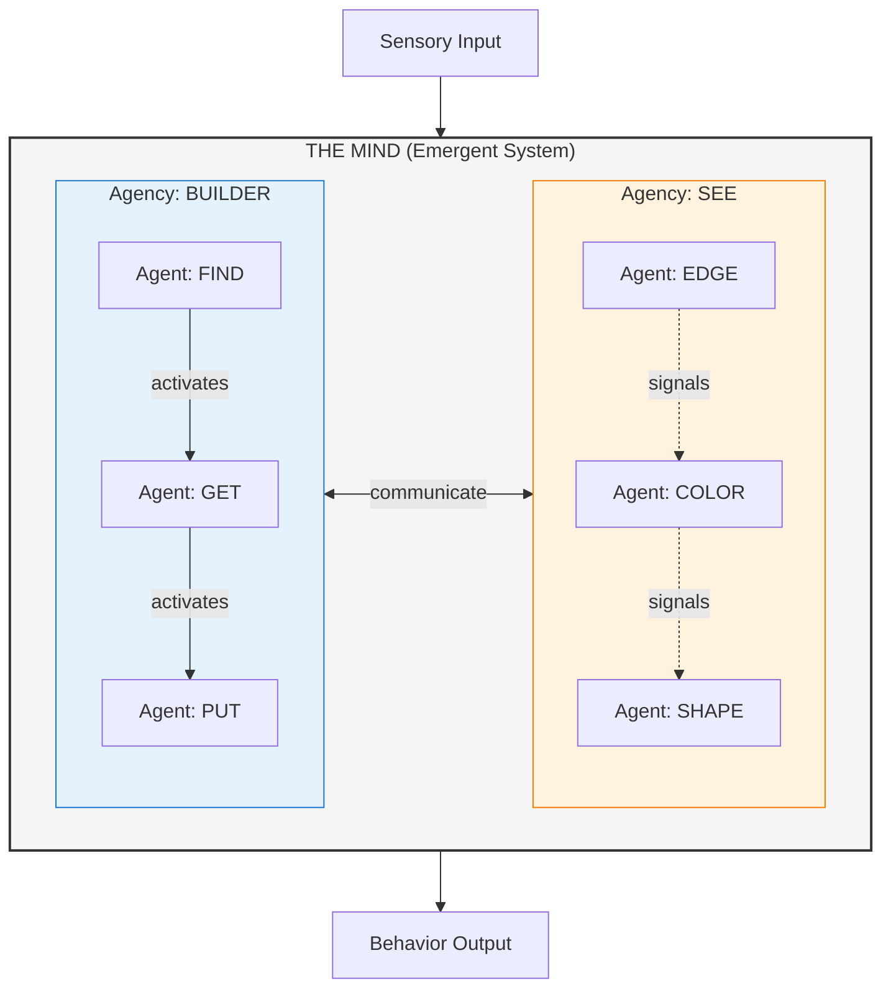
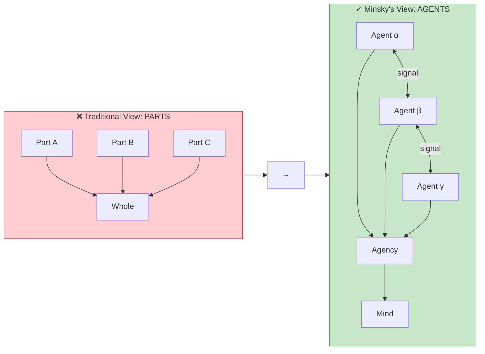
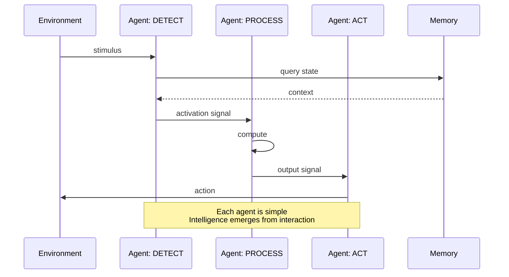
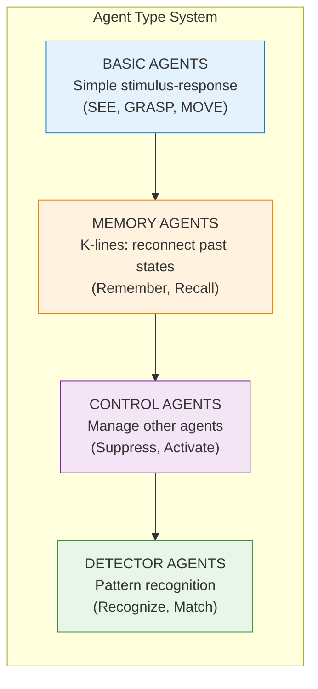

# S2 Genre-Specific: Agents (Technical/Cognitive Science Approach)

**Approach**: Technical visualization strategy
- Use component/architecture diagram style
- Show system layers and interactions
- Emphasize the paradigm shift (parts vs agents)
- Use data flow patterns (technical convention)

---

## Core Architecture Diagram

---

## Paradigm Shift: Parts vs Agents

---

## Agent Interaction Protocol

---

## Agent Type Hierarchy

---

## Analysis

**What this diagram does:**
- Shows system architecture (agencies containing agents)
- Visualizes the paradigm shift explicitly
- Uses sequence diagram for interaction protocol (technical convention)
- Shows type hierarchy with progression (technical pattern)
- Bidirectional arrows show dynamic interaction

**Technical/Cognitive Science improvements:**
- Component diagram style familiar to technical readers
- Sequence diagram shows temporal interaction
- Type system shows specialization hierarchy
- Architecture view reveals emergent structure
- Explicit contrast between old and new paradigms
