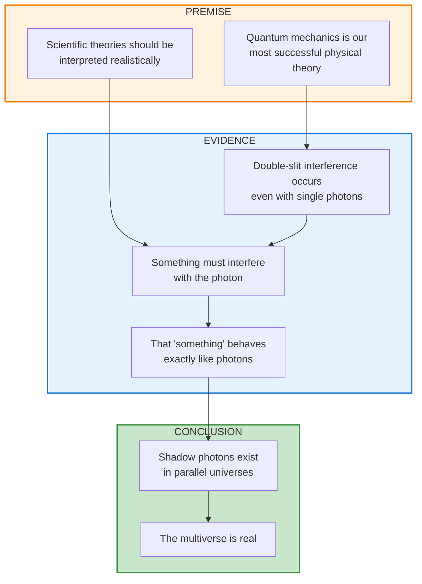
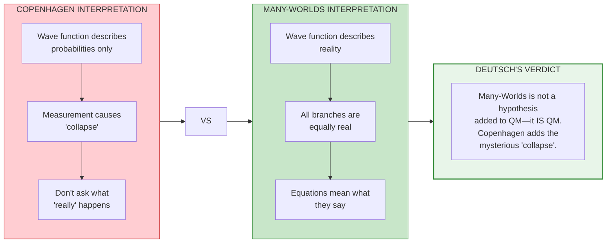
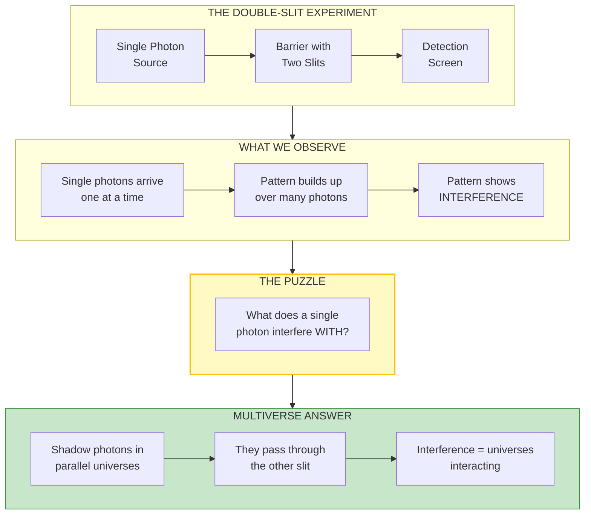
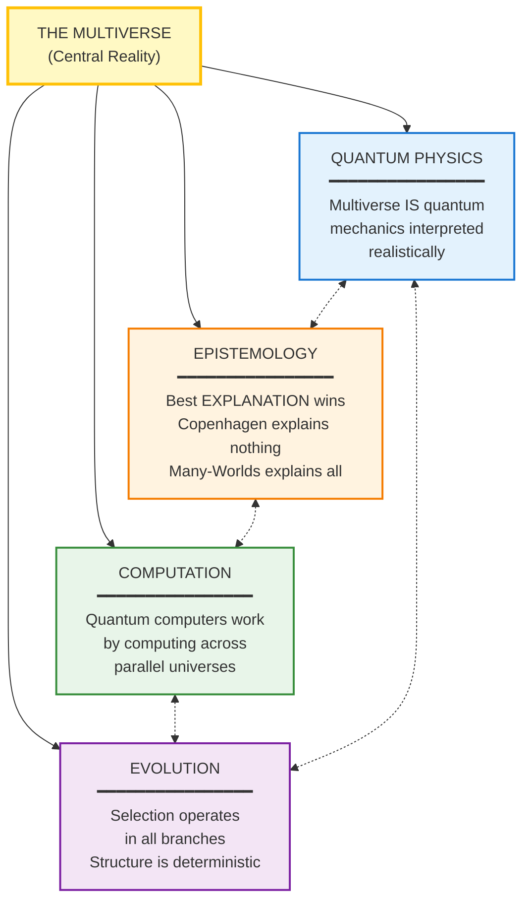

# S3 Genre-Specific: The Multiverse (Physics/Philosophy Approach)

**Approach**: Philosophical visualization strategy
- Use argument structure (premise → evidence → conclusion)
- Show dialectical contrast (Copenhagen vs Many-Worlds)
- Emphasize evidence flow (physics convention)
- Connect to broader framework (synthesis thinking)

---

## The Argument Structure

---

## Dialectical Contrast: Two Interpretations

---

## The Double-Slit Evidence

---

## Connection to Four Strands

---

## Analysis

**What this diagram does:**
- Shows explicit argument structure (philosophy convention)
- Dialectical contrast between interpretations
- Evidence flow from experiment to conclusion
- Connects to broader theoretical framework

**Physics/Philosophy improvements:**
- Argument structure makes the reasoning transparent
- Dialectical layout shows intellectual debate
- "Verdict" makes Deutsch's position clear
- Four strands diagram shows synthesis thinking
- Evidence diagram walks through the puzzle and answer
- Philosophical rigor: premises, evidence, conclusion separated
