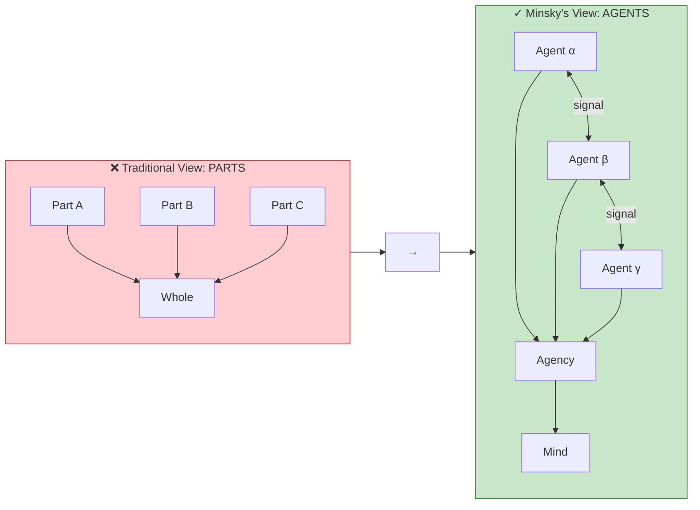

# Track 2 Mermaid: Paradigm Shift Diagram

**Source**: S2 Genre-Specific - Agents (Society of Mind)
**Diagram**: Parts vs Agents paradigm shift
**Tool**: Mermaid
**Time to create**: ~2 minutes (already had template)

---

## Mermaid Source

---

## Metrics

- **Lines of code**: 28
- **Render method**: Paste into any Mermaid-enabled tool
- **Output format**: SVG (rendered by JS)
- **Learning curve**: Low (markdown-like syntax)
